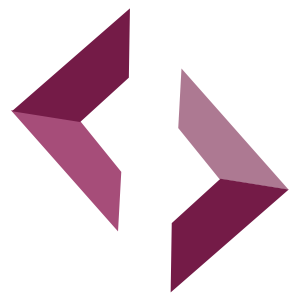

[](https://app.netlify.com/sites/pedantic-mclean-9d4228/deploys)
[](#contributors-)
<!--[](https://discord.gg/CetY6Y4)-->
[](https://twitter.com/synquery)
<!--[](https://crowdin.com/project/synquery-org)-->

<!--
  https://emojipedia.org/
-->
<h1 align="center" style="margin-top: 1em;border-bottom: 0 none;">
  <p><a href="https://synquery.org"></a></p>
  <p>🥂 synquery.org へようこそ!</p>
</h1>
<h5>
  （ <a href="./README.md" style="font-size:80%;"> README.md （英文）はこちら </a> ）
</h5>

このリポジトリは [synquery.org](https://synquery.org) のウェブサイト管理のためであり、また Synquery コミュニティのためのまとめ情報です。
世界中に Synquery コミュニティが広がるよう、さまざまな情報を掲載します。

Synquery は 2010 年にエンジニアのためのサービスプラットフォームとして、株式会社東雲の創設者である吉田氏によって日本で生み出されました。
その後 10 年余の時を経てリーダーは坂本氏へのと世代交代しました。同氏は暗号資産の技術、とりわけ [イーサリアム](https://synquery.org) と [シンボル(NEM2)](https://github.com/symbol) に興味を持ち、その中からコンピュータサイエンスのキーワードである「Human well-being」（よき生の実現による社会全体の幸福）の一端を担うコンセンサスアルゴリズム「PoSy」を考案しました。このアイデアは想定トランザクションの履行をステーク（持ち高）とすることで、新しい世界を表現しようとしています。
例えば、
  
  - スマートフォンの不要なウォレット決済
  - 対人サービスの還元価値向上
  - 福利厚生サービスの充実
  
などを目的としています。

[synquery.org](https://synquery.org) は常にリーダー、グループおよび協力者の有志の変更、フィードバックおよび管理活動によりアップデートされます。
もし本プロジェクトへの協力と貢献に関心がありましたら [参加するには](https://synquery.org/en/contributing/) をご確認の上、ぜひご参画ください。 

<!--
## Looking for the Synquery blockchain's code?

If you're looking for the Synquery blockchain itself, there is no single repo. Instead, 
Synquery has multiple implementations of the protocol written in different programming languages 
for security and diversity. [Check out the different implementations](https://synquery.org/en/developers/docs/nodes-and-clients/#clients)
-->

<hr style="margin-top: 3em; margin-bottom: 3em;">

# 参加方法

このプロジェクトは [all-contributors](https://github.com/all-contributors/all-contributors) により表記されます。 
心の向く形でご参加・ご協力いただければ、嬉しい限りです。

<!--
## synquery.org の更新方法:

### (手順1/8) 課題や問題を報告

- [new issue](https://github.com/synquery/synquery-org-website/issues/new/choose) を作成し、内容を入力ください。
- [Synquery Team が応答します](https://github.blog/2019-06-25-assign-issues-to-issue-commenters/).

### (手順2/8) 本リポジトリをフォーク(fork) 

- [フォークについての github のヘルプ](https://help.github.com/en/articles/fork-a-repo).

### (手順3/8)(任意) ローカル環境をセットアップ

If you're ready to contribute and create your PR, it will help to set up a local environment so you can see your changes.

1. [Set up your development environment](https://www.gatsbyjs.com/docs/tutorial/part-zero/)

2. Clone your fork

If this is your first time forking our repo, this is all you need to do for this step:

```
$ git clone git@github.com:[your_github_handle]/synquery-org-website.git && cd synquery-org-website
```

If you've already forked the repo, you'll want to ensure your fork is configured and that it's up to date. This will save you the headache of potential merge conflicts.

To [configure your fork](https://docs.github.com/en/github/collaborating-with-issues-and-pull-requests/configuring-a-remote-for-a-fork):

```
$ git remote add upstream https://github.com/synquery/synquery-org-website.git
```

To [sync your fork with the latest changes](https://docs.github.com/en/github/collaborating-with-issues-and-pull-requests/syncing-a-fork):

```
$ git checkout dev
$ git fetch upstream
$ git merge upstream/dev
```

3. Install dependencies

```
$ yarn
```

4. Add personal GitHub API token (free)

We recommend setting this up when running the project locally, as we use the GitHub API to fetch repository data for many projects & files.

> - [Follow these instructions](https://docs.github.com/en/github/authenticating-to-github/creating-a-personal-access-token) to create a personal GitHub API token
>   - When selecting scopes in step 8, leave everything unchecked (the data we fetch doesn't require any [scope](https://docs.github.com/en/developers/apps/scopes-for-oauth-apps#available-scopes))
> - In local repo root directory: Make a copy of `.env.example` and name it `.env`
> - Copy & paste your new GitHub API token into `.env`

```
// .env Example:
GATSBY_GITHUB_TOKEN_READ_ONLY=48f84de812090000demo00000000697cf6e6a059
```

5. Add Etherscan API token (free)

> - [Create an account](https://etherscan.io/) on Etherscan
> - Navigate to your Account Settings page
> - In the sidebar, click on 'API-KEYs' and add a new token
> - Copy & paste your Api-Key Token from Etherscan into `.env`

```
// .env Example:
ETHERSCAN_API_KEY=K6NUTARFJZJCIXHF1F1E1YGJZ8RQ29BE4U
```

6. Add DeFiPulse API token (free)

> - [Follow this guide](https://docs.defipulse.com/quick-start-guide) to create an account and get your DeFiPulse API token
> - Copy & paste your Active API Key from DeFiPulse into `.env`

```
// .env Example:
DEFI_PULSE_API_KEY=4953aaf7966dad9c129397e197a0630ed0594f66962dd5fb058972b250da
```

### (手順4/8) どんどん変更しましょう！

1. Create new branch for your changes

```
$ git checkout -b new_branch_name
```

2. Start developing!

```
$ yarn start
```

- Open this directory in your favorite text editor / IDE, and see your changes live by visiting `localhost:8000` from your browser
- Pro Tip: Explore scripts within `package.json` for more build options

3. Commit and prepare for pull request (PR). In your PR commit message, reference the issue it resolves (see [how to link a commit message to an issue using a keyword](https://docs.github.com/en/free-pro-team@latest/github/managing-your-work-on-github/linking-a-pull-request-to-an-issue#linking-a-pull-request-to-an-issue-using-a-keyword)).

```
$ git commit -m "brief description of changes [Fixes #1234]"
```

4. Push to your GitHub account

```
$ git push
```

### (手順5/8)(任意) Lambda で任意の機能を呼び出す

There may be times where you develop features that make external API requests to other services. For these we write lambda functions to obfuscate API keys. In order to test these locally, you will need to do the following:

1. Download a CORS enabling browser extension (ex: https://chrome.google.com/webstore/search/cors).
2. Enable CORS in the downloaded browser extension.
3. Add the relevant API key to the `.env` file.
4. After you have started your development server for synquery.org (above), start up a netlify lambda server using:

```
yarn start:lambda
```

5. Where you reference /.netlify functions for server calls, add a conditional to call localhost:9000 endpoints when not in the production environment.

### (手順6/8) dev ブランチに PR (プルリクエスト) してください！

- After your changes are committed to your GitHub fork, submit a pull request (PR) to the `dev` branch of the `synquery/synquery-org-website` repo
- In your PR description, reference the issue it resolves (see [linking a pull request to an issue using a keyword](https://docs.github.com/en/free-pro-team@latest/github/managing-your-work-on-github/linking-a-pull-request-to-an-issue#linking-a-pull-request-to-an-issue-using-a-keyword))
  - ex. `Updates out of date content [Fixes #1234]`
- Netlify (our hosting service) deploys all PRs to a publicly accessible preview URL, e.g.:
  
- _Confirm your Netlify preview deploy looks & functions as expected_
- Why not say hi and draw attention to your PR in [our discord server](https://discord.gg/CetY6Y4)?

### (手順7/8) レビュー完了をお待ちください。

- The website team reviews every PR
- See [how decisions are made on content changes](https://synquery.org/en/contributing/#how-decisions-about-the-site-are-made)
- Acceptable PRs will be approved & merged into the `dev` branch
-->

### (手順8/8) dev ブランチの変更完了、そしてリリースがアナウンスされます

- `master` is continually synced to Netlify and will automatically deploy new commits to synquery.org
- The [website team](https://synquery.org/en/contributing/#how-decisions-about-the-site-are-made) will periodically merge `dev` into `master` (typically multiple times per week)
- You can [view the history of releases](https://github.com/synquery/synquery-org-website/releases), which include PR highlights

## Translation Program

_The Translation Program is an initiative to translate synquery.org into different languages and make the website accessible to people from all over the world._

If you are looking to get involved as a translator, you can [join our project in Crowdin](https://crowdin.com/project/synquery-org/invite/) and start translating the website to your language immediately.

To get more information about the program, learn how to use Crowdin, check on the progress or find some useful tools for translators, please visit the [Translation Program page](https://synquery.org/en/contributing/translation-program/).

<hr style="margin-top: 3em; margin-bottom: 3em;">

## synquery.org ウェブサイトで利用している技術とサービス

- [Node.js](https://nodejs.org/)
- [Yarn package manager](https://yarnpkg.com/cli/install)
- [webpack](https://webpack.js.org/)
- [Netlify](https://www.netlify.com/) - DNS 管理と [`master` build](https://synquery.org) および [`dev` build](https://dev.synquery.org) のホスティング
- [Crowdin](https://crowdin.com/) - 翻訳作業の効率化 (「翻訳の先導」について参照)
- [GitHub Actions](https://github.com/features/actions) -  CI/CD と課題や問題のトラッキング
- [GraphQL](https://graphql.org/) - API のためのクエリフォーマット
- [Algolia](https://www.algolia.com/) - Site indexing, rapid intra-site search results, and search analytics. [Learn more on how we implement Algolia for site search](./docs/ALGOLIA_DOCSEARCH.md).
  - Primary implementation: `/src/components/Search/index.js`

### Code structure

| Folder                                   | Primary use                                                                                                                                                                                                         |
| ---------------------------------------- | ------------------------------------------------------------------------------------------------------------------------------------------------------------------------------------------------------------------- |
| `/src`                                   | Main source folder for development                                                                                                                                                                                  |
| `/src/assets`                            | Image assets                                                                                                                                                                                                        |
| `/src/content`                           | Markdown/MDX files for site content stored here. <br>For example: `synquery.org/en/about/` is built from `src/content/about/index.md` <br>The markdown files are parsed and rendered by `src/templates/static.js`\* |
| `/src/content/developers/docs`           | \*Markdown files in here use the Docs template: `src/templates/docs.js`                                                                                                                                             |
| `/src/content/developers/tutorials`      | \*Markdown files in here use the Tutorial template: `src/templates/tutorial.js`                                                                                                                                     |
| `/src/data`                              | General data files importable by components                                                                                                                                                                         |
| `/src/intl`                              | Language translation JSON files                                                                                                                                                                                     |
| `/src/lambda`                            | Lambda function scripts for API calls                                                                                                                                                                               |
| `/src/pages`<br>`/src/pages-conditional` | React components that function as standalone pages. <br>For example: `synquery.org/en/wallets/find-wallet` is built from `src/pages/wallets/find-wallet.js`                                                        |
| `/src/scripts`<br>`/src/utils`           | Custom utility scripts                                                                                                                                                                                              |
| `/src/styles`                            | Stores `layout.css` which contains root level css styling                                                                                                                                                           |
| `/src/templates`                         | JSX templates that define layouts of different regions of the site                                                                                                                                                  |
| `/src/theme.js`                          | Declares site color themes, breakpoints and other constants (try to utilize these colors first)                                                                                                                     |

<!--
<hr style="margin-top: 3em; margin-bottom: 3em;">

## Website conventions / best practices

### ❗️ Translation initiative

_Please read carefully if adding or altering any written language content_

How to prepare your content for translation depends on whether you're working on a simple Markdown/MDX page or a React component page.

**- MDX pages (`/src/content/page/`)**

Markdown will be translated as whole pages of content, so no specific action is required. Simply create a new folder within `/src/content/` with the name of the page, then place index markdown file (ie. `index.md`) within new folder.

## Styling

- `src/theme.js` - Declares site color themes, breakpoints and other constants (try to utilize these colors first)
- We use [styled-components](https://styled-components.com/)

  - Tagged template literals are used to style custom components

  ```
  // Example of styling syntax using styled-components

  import styled from "styled-components"

  const GenericButton = styled.div`
    width: 200px;
    height: 50px;
  `
  const PrimaryButton = styled(GenericButton)`
    background: blue;
  `
  const SecondaryButton = styled(GenericButton)`
    background: red;
  `

  // These are each components, capitalized by convention, and can be used within JSX code
  // ie: <PrimaryButton>Text</PrimaryButton>
  ```

  - Recommended VS Code Plugin: `vscode-styled-components` <br>To install: Open VS Code > `Ctrl+P` / `Cmd+P` > Run: <br>`ext install vscode-styled-components`

- Values from `src/theme.js` are automatically passed as a prop object to styled components

  ```
  // Example of theme.js usage

  import styled from "styled-components"

  const Container = styled.div`
    background: ${(props) => props.theme.colors.background};
    @media (max-width: ${(props) => props.theme.breakpoints.s}) {
      font-size: #{(props) => props.theme.fontSized.s};
    }
  `
  ```

- [Framer Motion](https://www.framer.com/motion/) - An open source and production-ready motion library for React on the web, used for our animated designs
- **Emojis**: We use [Twemoji](https://twemoji.twitter.com/), an open-source emoji set created by Twitter. These are hosted by us, and used to provide a consistent experience across operating systems.

```
// Example of emoji use
import Emoji from "./Emoji"

// Within JSX:
<Emoji text=":star:" size={1} /> // sized in `em`
```

## Image loading and API calls using GraphQL

- [Gatsby + GraphQL](https://www.gatsbyjs.com/docs/graphql/) used for loading of images and preferred for API calls (in lieu of REST, if possible/practical). Utilizes static page queries that run at build time, not at run time, optimizing performance.
- Image loading example:

```
import { graphql } from "gatsby"

export const query = graphql`
  query {
    hero: file(relativePath: { eq: "developers-eth-blocks.png" }) {
      childImageSharp {
        fluid(maxWidth: 800) {
          ...GatsbyImageSharpFluid
        }
      }
    }
  }
`
// These query results get passed as an object `props.data` to your component
```

- API call example:

```
import { graphql } from "gatsby"

export const repoInfo = graphql`
  fragment repoInfo on GitHub_Repository {
    stargazerCount
    languages(orderBy: { field: SIZE, direction: DESC }, first: 2) {
      nodes {
        name
      }
    }
    url
  }
`
export const query = graphql`
  query {
    hardhatGitHub: github {
      repository(owner: "nomiclabs", name: "hardhat") {
        ...repoInfo
      }
    }
  }
`
// These query results get passed as an object `props.data` to your component
```

<hr style="margin-top: 3em; margin-bottom: 3em;">
-->

<!--


## Claim your POAP!

### What is POAP?

> The Proof of Attendance Protocol is a dapp that distributes badges in the form of ERC-721 tokens to prove you participated in an event. [More on POAPs](https://www.poap.xyz/).

### synquery.org 2021 Contributor POAP

- If you have committed any changes in 2021 so far that were merged into our repo, you have a POAP waiting!
- This includes our dedicated translators on Crowdin

  [](https://discord.gg/CetY6Y4)

- 👆 To claim your Contributor POAP, join our Discord server and paste a link to your contribution in the #poaps-🏆 channel

- A member of our team will verify the request and DM you with a personalized link to claim your own freshly minted POAP collectible!

- To help with verification we request GitHub contributors connect their GitHub account with their Discord account (Discord > Settings > Connections > GitHub). Crowdin contributors will be verified directly through Crowdin by our team.

- If you haven't contributed yet and would like to earn a POAP to show your loyalty to the Synquery space, head over to the [issues](https://github.com/synquery/synquery-org-website/issues/) tab to get started!
-->

<hr style="margin-top: 3em; margin-bottom: 3em;">

## 謝辞

協力者および関係者の皆様に、心より感謝いたします [👏](https://allcontributors.org/docs/en/emoji-key):

<!-- ALL-CONTRIBUTORS-LIST:START - Do not remove or modify this section -->
<!-- prettier-ignore-start -->
<!-- markdownlint-disable -->
<!--
<table>
  <tr>
    <td align="center"><a href="https://bio.link/saksham"><br /><sub><b>SA KSH AM </b></sub></a><br /><a href="#content-sakshamgurbhele" title="Content">🖋</a></td>
    <td align="center"><a href="https://github.com/RedWolf4845"><br /><sub><b>Samrat</b></sub></a><br /><a href="#content-RedWolf4845" title="Content">🖋</a></td>
    <td align="center"><a href="http://justinshaw.eth"><br /><sub><b>Justin Shaw</b></sub></a><br /><a href="#content-notjustinshaw" title="Content">🖋</a></td>
    <td align="center"><a href="https://meow.page"><br /><sub><b>meoww-bot</b></sub></a><br /><a href="https://github.com/synquery/synquery-org-website/commits?author=meoww-bot" title="Documentation">📖</a></td>
    <td align="center"><a href="http://moonsdontburn.design"><br /><sub><b>Philip Vu</b></sub></a><br /><a href="https://github.com/synquery/synquery-org-website/commits?author=GhostWalker562" title="Documentation">📖</a></td>
    <td align="center"><a href="http://connerjensen.com"><br /><sub><b>Conner Jensen</b></sub></a><br /><a href="https://github.com/synquery/synquery-org-website/commits?author=connerj70" title="Documentation">📖</a></td>
    <td align="center"><a href="https://jhaymesdev.web.app/"><br /><sub><b>Jhaymes</b></sub></a><br /><a href="#ideas-jhaymesdev" title="Ideas, Planning, & Feedback">🤔</a></td>
  </tr>
</table>
-->
<!-- markdownlint-restore -->
<!-- prettier-ignore-end -->

<!-- ALL-CONTRIBUTORS-LIST:END -->


<!--
### Join our Discord server

We have a space to discuss all things synquery.org – share your ideas or just say hi over [on Discord](https://discord.gg/CetY6Y4).
-->